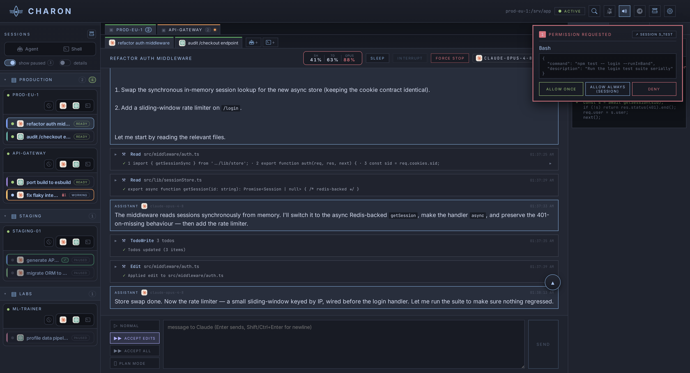
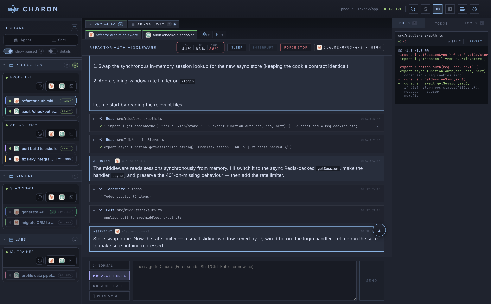
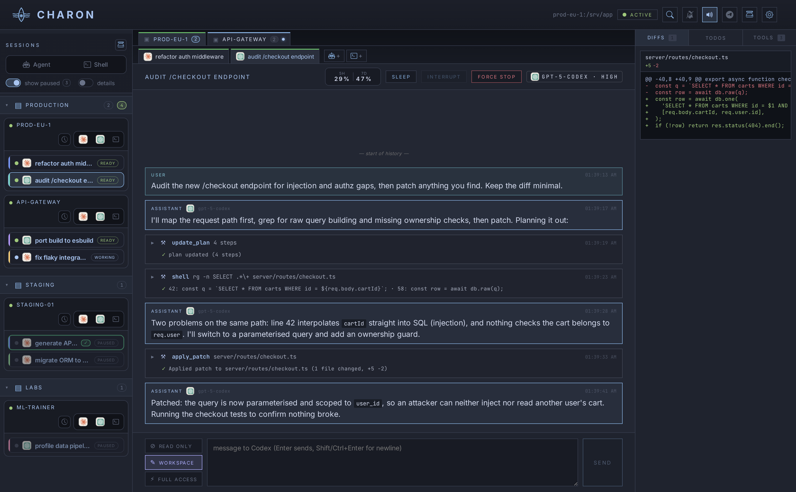
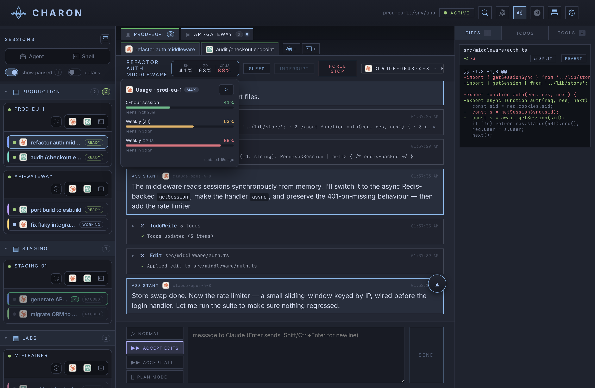
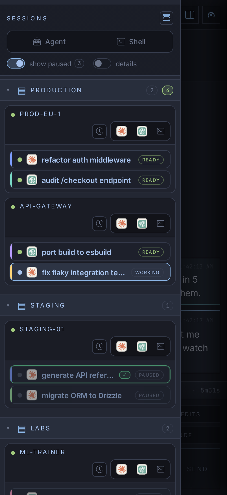
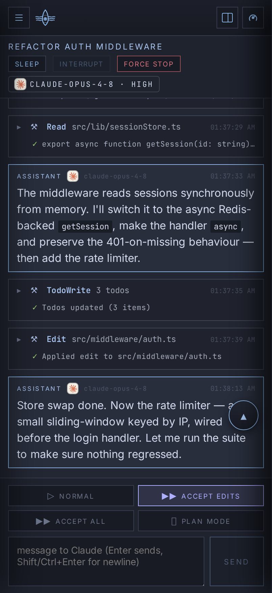
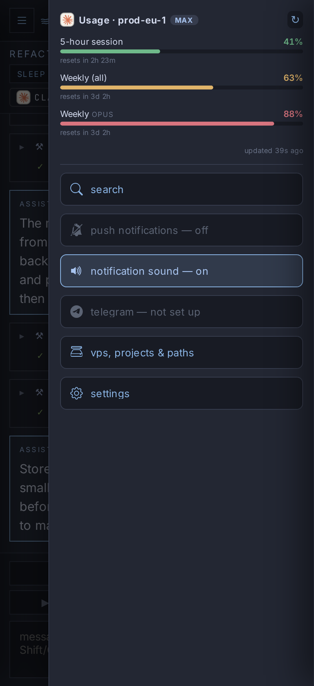
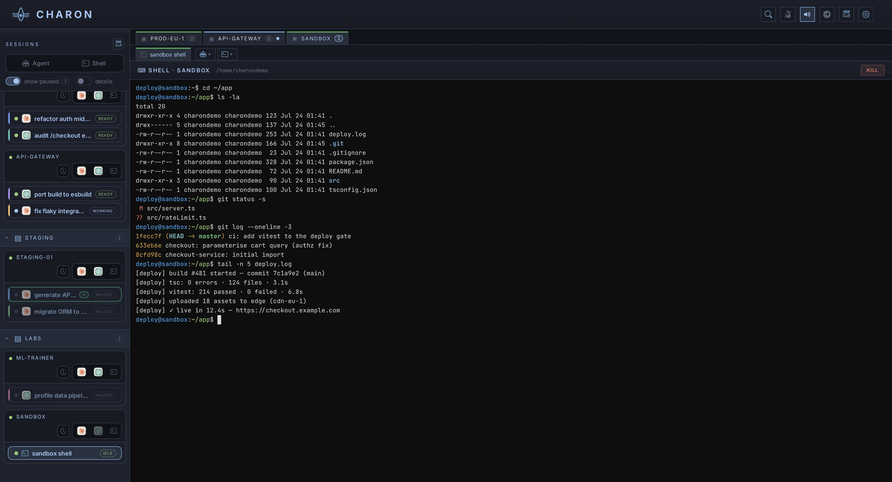

# Charon

[](https://github.com/Lomchat/charon/actions/workflows/ci.yml)
[](./LICENSE)
[](https://nodejs.org)
[](https://www.python.org)
[](https://nextjs.org)

> **One browser tab to run AI coding sessions _and_ live shells across all your
> remote servers.** Charon is a self-hosted hub with **two co-equal uses**:
>
> 1. **A coding-agent hub** — launch and supervise
>    [Claude Code](https://docs.claude.com/en/docs/claude-code) /
>    [Claude Agent SDK](https://docs.claude.com/en/docs/claude-code/sdk) **and
>    [OpenAI Codex](https://github.com/openai/codex)** sessions, side by side on
>    any SSH-reachable VPS, with token-streamed replies, a permission flow
>    (Claude) or sandbox modes (Codex), diff capture & revert, live account-usage
>    gauges and notifications.
> 2. **A persistent SSH-shell manager** — full xterm.js terminals on those same
>    boxes that **survive Charon restarts, agent restarts/updates and browser
>    closes** (the PTY lives in a detached holder on the VPS).

Everything runs from a single window. Both the sessions and the shells live in a
daemon (`charon-agent`) on each VPS, so they keep running when your laptop
sleeps, your network drops, or you restart the hub. Charon is just the control
plane.



```
┌───────────────┐  HTTPS/SSE   ┌────────────────────────┐  SSH (1 per VPS)  ┌──────────────────────┐
│   Browser     │ ◄──────────► │  Charon (Next.js)      │ ◄───────────────► │  charon-agent (VPS)  │
│  sessions +   │  SSE / POST  │  - 1 SSH per VPS       │  exec: pyz        │  - asyncio Unix sock │
│  shells (1 tab)│             │  - JSON-RPC multiplex  │  --connect proxy  │  - N SDK sessions    │
│               │              │  - SQLite (charon.db)  │  stdio↔socket     │  - detached shells   │
└───────────────┘              └────────────────────────┘                   └──────────────────────┘
```

---

## The two halves

### 1 · Coding sessions — Claude _and_ Codex, one UI

</img>
</img>

Each session is an independent agent running **on the VPS**, not on your
machine — a `ClaudeSDKClient` (Claude) or an OpenAI Codex thread (via the Codex
app-server). Both speak the same UI:

- **Token-by-token streaming** of the answer, with **collapsible thinking
  blocks** and tool calls **paired with their results** in a side panel — Claude
  tools (`Read`/`Edit`/`Bash`/…) and Codex tools (`shell`/`apply_patch`/
  `update_plan`/…) alike.
- **Approval you control** — Claude pauses on every `Edit`/`Bash`/`Write` for
  _allow once_ / _allow always (this session)_ / _deny_; Codex runs under a
  **sandbox mode** (read-only / workspace-write / full-access). Either way you're
  pinged by **Web Push + Telegram** when a session needs you.
- **Diff capture & revert** — every edit stores a `before`/`after` snapshot (a
  unified diff for Codex); one click rewinds a file.
- **Per-session model & reasoning effort**, a **todo / plan panel**, **live
  account-usage gauges** (your Claude or Codex quota), **full-text search** across
  all history, and **browser sign-in** for both (`claude login` proxied over SSH;
  Codex via a ChatGPT device-code flow).
- **Survives everything** — restart Charon, restart the agent, drop the
  network: the session keeps running and the UI reattaches with a durable replay
  of anything it missed. No more "my terminal died, my session is gone".

</img>

The **same UI reflows to a phone** — no separate mobile app, just responsive
breakpoints (the sidebar and tool panel become drawers; usage gauges move from
the header to a drawer):

</img>
</img>
</img>

### 2 · Persistent SSH shells



Real **xterm.js** terminals, multiple per VPS, right next to your Claude and
Codex sessions:

- The **PTY + bash live in a detached holder** on the VPS — the shell survives a
  Charon restart **and** an agent restart/update. Reopen it days later and your
  scrollback is replayed from a durable per-shell log.
- WebSocket transport (binary for the hot path), instant tail-replay on
  reconnect, idle "finished" notifications, last-resize-wins across devices.
- Shared across desktop and the mobile UI.

---

## Why

Running long Claude Code sessions on a laptop is fragile: if your terminal dies,
your network drops, or your machine sleeps, the session is gone. The same is
true of an `ssh` session you forgot in a tmux you can't find. Charon moves both
into a daemon on the VPS and gives you one durable, notify-on-event window over
your whole fleet.

## Features at a glance

- **Two backends, one UI** — run **Claude** and **OpenAI Codex** sessions side by
  side on the same fleet; each VPS can offer either, both, or neither.
- **Multi-VPS dashboard** — sidebar grouped by folder → VPS → sessions & shells,
  per-VPS health chips, drag-and-drop between folders, "show paused" / "details"
  toggles.
- **Persistent sessions** — Claude and Codex sessions survive Charon/agent
  restarts and network drops; auto-resume on boot, durable event-log replay on
  reconnect.
- **Persistent shells** — detached-holder PTYs that outlive the hub and the
  agent (see above).
- **One SSH connection per VPS**, JSON-RPC multiplexed — no per-session SSH
  spawns.
- **Streaming chat UI**, **permission flow / sandbox modes**, **diff & revert**,
  **todo / plan panel**, **full-text search**, **per-session model & effort**.
- **Account-usage gauges** — the `/usage` quota (5-hour, weekly, per-model caps)
  for each session's Claude or Codex account, live in the header.
- **Notifications** — Web Push + Telegram on pending permissions, questions,
  turn-completions and idle shells.
- **One responsive UI** — the same components reflow from a 3-column desktop to
  tablet/phone drawers; no separate mobile app.
- **One-click VPS bootstrap** — detects the distro, installs Python +
  `claude-agent-sdk` (+ optional `openai-codex`) + the `claude` CLI, deploys the
  agent zipapp, registers a systemd-user service (or `nohup` + cron fallback).
- **Resilient by design** — the frontend re-syncs after a hub restart without a
  manual refresh (boot-time agent arming, status reconcile, SSE auto-recovery).

## Requirements

**Charon host (where the dashboard runs):** Node.js ≥ 20, `openssl`, an `ssh`
client. SQLite is bundled via `better-sqlite3` — no system SQLite needed.

**Each target VPS:** SSH access **by key** (no password auth) and Python ≥ 3.10.
For **Claude**, the `claude-agent-sdk` and the `claude` CLI for the one-time
OAuth `claude login`. For **Codex** (optional), the `openai-codex` SDK and a
one-time ChatGPT sign-in (a device-code flow from the browser). The bootstrap
installer sets these up on Ubuntu/Debian (apt), Fedora/RHEL-like (dnf), Alpine
(apk) and Arch (pacman) — Codex support is installed automatically when
available. Other Linux distros may work but are untested; macOS/Windows/\*BSD as
VPS targets are not supported.

## Quickstart

```bash
git clone https://github.com/Lomchat/charon.git
cd charon
cp .env.example .env
# Edit .env:
#   - MASTER_PASSWORD : a strong passphrase you'll remember (it's your login)
#   - generate three secrets:
#       openssl rand -hex 32   # → MASTER_SALT
#       openssl rand -hex 32   # → SESSION_SECRET
#       openssl rand -hex 32   # → SYNC_TOKEN

npm ci
npm run db:migrate
npm run build
npm start
# → http://127.0.0.1:10556
```

Open the URL, log in with your `MASTER_PASSWORD`, and you're in.

### Run with Docker

```bash
cp .env.example .env          # fill MASTER_PASSWORD + the three secrets as above
# Charon needs an SSH private key to reach your VPS. Point CHARON_SSH_KEY at it
# (mounted read-only into the container) or drop one in ./data — see
# docker-compose.yml. The SQLite DB persists in the ./data volume.
docker compose up -d --build
# → http://127.0.0.1:10556
```

### Adding your first VPS

1. Sidebar toolbar → **＋ Agent** (or the VPS settings modal) → add name, IP, SSH
   user, port, default path.
2. The VPS appears with a red dot (agent not installed). Click **install** — the
   panel streams every phase: detect OS → install Python → `claude-agent-sdk`
   (+ `openai-codex`) → `claude` CLI → deploy agent → register service → ping
   (~30–90 s on a fresh box). Per-VPS **health chips** then show which of ssh /
   agent / Claude / Codex are ready.
3. Sign in per backend you'll use: **claude login** opens a TUI in your browser
   (OAuth proxied over SSH); **codex login** shows a ChatGPT device code you
   confirm on any device. Each is per-VPS.
4. On that VPS's row, hit **＋** to launch a **Claude** or **Codex** session (each
   button is greyed until that backend is ready) → pick a working directory →
   first prompt. Or the terminal button for a **＋ Shell**.

### Behind a reverse proxy (production)

Charon binds to `127.0.0.1:10556`. Put a TLS-terminating reverse proxy in front.
The session cookie is `Secure` when `NODE_ENV=production`, so the proxy **must**
serve HTTPS. It must also forward **SSE** (no buffering) **and** the WebSocket
**Upgrade** for shells. `GET /api/health` is an unauthenticated liveness probe
(200 when the DB is reachable, 503 otherwise). Example nginx:

```nginx
server {
  listen 443 ssl http2;
  server_name charon.example.com;
  ssl_certificate ...; ssl_certificate_key ...;

  location / {
    proxy_pass http://127.0.0.1:10556;
    proxy_http_version 1.1;
    proxy_set_header Host $host;
    proxy_set_header X-Forwarded-Proto $scheme;
    proxy_set_header X-Forwarded-For $proxy_add_x_forwarded_for;
    # WebSocket upgrade (persistent shells)
    proxy_set_header Upgrade $http_upgrade;
    proxy_set_header Connection $connection_upgrade;   # map: ''→'', 'upgrade'→'upgrade'
    # SSE — no buffering, long timeouts
    proxy_buffering off; proxy_cache off;
    proxy_read_timeout 1h; proxy_send_timeout 1h;
  }
}
```

A systemd unit example is in [docs/charon.service.example](./docs/charon.service.example).

### Notifications

- **Web Push** works out of the box: VAPID keys are auto-generated on first run;
  click the bell in the header to subscribe the current browser. Set
  `VAPID_SUBJECT` (a `mailto:`/`https:` identity) or override it in Settings.
- **Telegram** (optional): create a bot with @BotFather, then enter the **bot
  token** and your **chat id** in **Settings → Notifications**.
- Both are gated by a global notifications toggle in Settings.

## Environment variables

| Variable          | Required | Description                                                                                            |
| ----------------- | :------: | ------------------------------------------------------------------------------------------------------ |
| `MASTER_PASSWORD` |   yes    | Login password (checked with a timing-safe compare; also seeds an scrypt-derived key reserved for future settings encryption — see *Architecture notes*). |
| `MASTER_SALT`     |   yes    | scrypt salt. `openssl rand -hex 32`. Treat as a secret.                                                 |
| `SESSION_SECRET`  |   yes    | HMAC key for session-token hashing: the browser cookie holds a raw random token, the DB stores only `HMAC-SHA256(SESSION_SECRET, token)` — a leaked DB copy can't be replayed into a valid cookie. Changing it logs everyone out. `openssl rand -hex 32`. |
| `SYNC_TOKEN`      |   yes    | Bearer token gating `POST /api/sync`. `openssl rand -hex 32`.                                           |
| `DATABASE_URL`    |    no    | SQLite path. Defaults to `./data/charon.db`.                                                            |
| `HOST` / `PORT`   |    no    | Bind host/port. Default `127.0.0.1:10556`.                                                              |
| `NODE_ENV`        |    no    | `production` enables HSTS + `Secure` cookies.                                                           |
| `VAPID_SUBJECT`   |    no    | Web Push identity (`mailto:…`/`https:…`). Override-able in Settings. Default `mailto:admin@example.com`. |

## Architecture notes

The short version. The long version, with the *why*, is in
[`docs/adr-001-charon-agent.md`](./docs/adr-001-charon-agent.md); the operational
guide is in [`CLAUDE.md`](./CLAUDE.md).

- **Charon hub** (this repo): Next.js 15 App Router, React 19, SQLite via Drizzle
  + `better-sqlite3`. SSR + SSE-streamed UI. One process, single-user.
- **`charon-agent`**: a Python **stdlib-only zipapp** deployed to each VPS at
  `~/.charon/charon-agent.pyz`. Listens on a Unix socket, hosts N sessions —
  `ClaudeSDKClient` (Claude) and/or OpenAI Codex threads via the `openai-codex`
  SDK — plus the detached shell holders, checkpointing state to
  `~/.charon/state.json` after every change.
- **Transport**: one long-running SSH per VPS, the agent invoked as
  `exec ~/.charon/charon-agent.pyz --connect` (stdio ↔ Unix socket). Backoff
  reconnect on drop.
- **Persistence & replay**: sessions survive Charon restarts (the agent keeps
  running), agent restarts (state.json restores them in `resume` mode), and
  network drops. On reconnect Charon replays exactly the events it missed from a
  **durable per-session append-only event log** (monotonic `seq` cursor); an
  in-memory ring buffer is only the fast path and is not relied on for recovery.
- **Security**: single-user (one `users` row, seeded from `MASTER_PASSWORD`).
  Cookies `HttpOnly`, `SameSite=Lax`, `Secure` in prod. Headers:
  `X-Frame-Options: DENY`, HSTS in prod, `Referrer-Policy`, `Permissions-Policy`.
  No CSP yet (Next inlines SSR scripts without a nonce — see `next.config.mjs`).
  Each VPS's Unix socket is `chmod 600` and the agent opens **no** TCP port — all
  traffic is over SSH, so your SSH key is the authorization boundary.

### About `MASTER_PASSWORD`

It is (1) the login password and (2) the seed for the scrypt-derived AES-256
key (`scrypt(MASTER_PASSWORD, MASTER_SALT)`) that encrypts secret settings at
rest in SQLite (Telegram bot token, Anthropic API key, Web Push private key —
stored as `enc:v1:` AES-GCM blobs; plaintext rows are migrated automatically
at boot). Session tokens are additionally stored hashed (see `SESSION_SECRET`
above). **Changing `MASTER_PASSWORD` or `MASTER_SALT` without re-entering the
secrets loses them** — decryption fails closed and the UI shows them as
unconfigured; re-enter them in Settings to recover. Rotation is manual today
(re-enter secrets after changing the env). Still treat the DB file and
backups as sensitive (transcripts aren't encrypted).

### About the agent `.pyz` blob

`agent/dist/charon-agent.pyz` is committed because Charon base64-pipes it to each
VPS during bootstrap. After any change to `agent/charon_agent/`, regenerate it
with `bash agent/build.sh` (CI rebuilds it on every push).

## Known quirks

- **`next build --turbopack` breaks `next start`** on Next 15.5.x (all
  `_next/static/*` 404). The `build` script does *not* pass `--turbopack`; dev
  mode does, which is fine.
- **`reactStrictMode: false`** is intentional — dev double-render duplicates SSE
  events and races the interaction queues.
- **A `.next` polluted by a crashed `next dev`** makes `next start` loop with
  *"Could not find a production build"*. Fix: `rm -rf .next && npm run build`.
- **`claude login` is per-VPS** — there is no shared OAuth (this is how the
  upstream `claude` CLI works).

## Troubleshooting

| Symptom | Fix |
| --- | --- |
| Blank page, 404 on `/_next/static/*` | Built with `--turbopack`. `rm -rf .next && npm run build`. |
| `next start` loops "Could not find a production build" | A dev process polluted `.next`. Same fix. |
| Sidebar shows a red dot next to a VPS | Agent not installed/reachable. Click **install** → watch the bootstrap stream. |
| "Agent out of date" badge | Bundled `.pyz` SHA ≠ the one in DB. Click **Update agent**. |
| Shell stuck "reconnecting…" behind a proxy | The reverse proxy isn't forwarding the WebSocket `Upgrade`. See the nginx block above. |
| Session stuck on "thinking" | The SDK ignored an `interrupt`. Use **Force stop** (resumable). |
| `ensurepip is not available` during install | The VPS lacks `python3-venv`. Bootstrap auto-installs it on apt/dnf — open an issue for other distros. |

## Non-goals

- **No multi-tenant / multi-user / RBAC / SSO.** Single-user by design; fork if
  you need a team dashboard.
- **No VPS provisioning.** Charon expects VPS that already exist and are
  SSH-reachable by key.
- **No Windows / \*BSD / macOS-as-VPS support.**
- **No cloud-hosted version.** Self-hosted only.

## Contributing

Bug reports and PRs welcome. See [CONTRIBUTING.md](./CONTRIBUTING.md) for dev
mode, migrations, the JSON-RPC protocol, and the PR flow. By participating you
agree to the [Code of Conduct](./CODE_OF_CONDUCT.md). Security issues: follow
[SECURITY.md](./SECURITY.md) — please don't open a public issue.

The UI is English; some internal comments/docs (notably `CLAUDE.md`) are still
partly French — translation PRs welcome.

> Screenshots use 100% fictitious data (see `scripts/demo-seed.mjs`,
> `scripts/demo-shots.mjs` and `scripts/demo-agent-setup.sh` for the isolated
> local agent that backs the live shell shot).

## License

[Apache 2.0](./LICENSE) © Lomchat.
