# Charon

[](https://github.com/Lomchat/charon/actions/workflows/ci.yml)
[](./LICENSE)
[](https://nodejs.org)
[](https://www.python.org)
[](https://nextjs.org)

> **One browser tab to run AI coding sessions — and read, edit, commit and
> ship what they write — across all your remote servers.** Charon is a
> self-hosted hub with **three co-equal halves**:
>
> 1. **A coding-agent hub** — launch and supervise
>    [Claude Code](https://docs.claude.com/en/docs/claude-code) /
>    [Claude Agent SDK](https://docs.claude.com/en/docs/claude-code/sdk) **and
>    [OpenAI Codex](https://github.com/openai/codex)** sessions, side by side on
>    any SSH-reachable VPS, with streamed replies, human approval gates,
>    fork / rewind / compact / review controls, diffs, usage gauges, skills,
>    MCP tools, sub-agents and notifications.
> 2. **A small IDE over SSH** — a **tabbed workspace**, a **file explorer** rooted
>    at each session's working directory, a real **code editor** with conflict-safe
>    saves, and **source control**: branch, changed files, per-file diffs, commit,
>    push, pull.
> 3. **A persistent SSH-shell manager** — full xterm.js terminals on those same
>    boxes that **survive Charon restarts, agent restarts/updates and browser
>    closes** (the PTY lives in a detached holder on the VPS).

Everything runs from a single window. The sessions, the file access and the
shells all live in one daemon (`charon-agent`) per VPS, so they keep running when
your laptop sleeps, your network drops, or you restart the hub. Charon is just
the control plane.

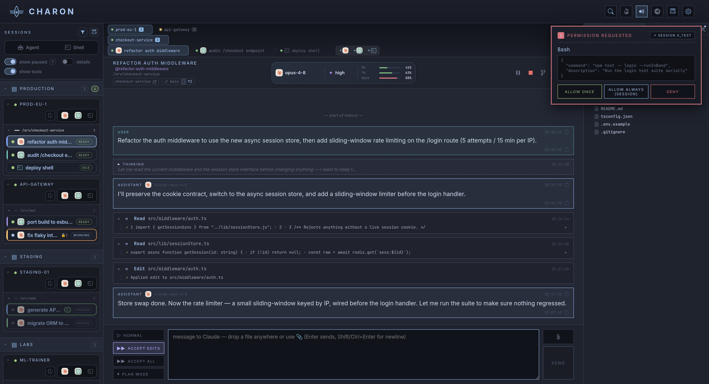

```
┌───────────────┐  HTTPS/SSE   ┌────────────────────────┐  SSH (1 per VPS)  ┌──────────────────────┐
│   Browser     │ ◄──────────► │  Charon (Next.js)      │ ◄───────────────► │  charon-agent (VPS)  │
│  sessions +   │  SSE / POST  │  - 1 SSH per VPS       │  exec: pyz        │  - asyncio Unix sock │
│  files +      │              │  - JSON-RPC multiplex  │  --connect proxy  │  - N SDK sessions    │
│  shells       │              │  - SQLite (charon.db)  │  stdio↔socket     │  - files · git       │
│  (1 tab)      │              │                        │                   │  - detached shells   │
└───────────────┘              └────────────────────────┘                   └──────────────────────┘
```

---

## 1 · Coding sessions — Claude _and_ Codex, one UI

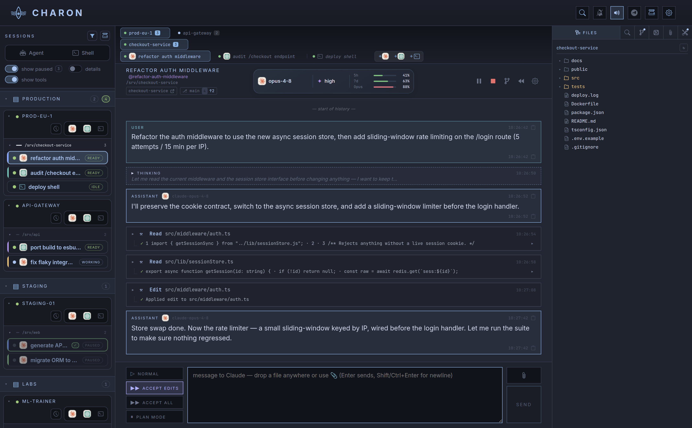</img>
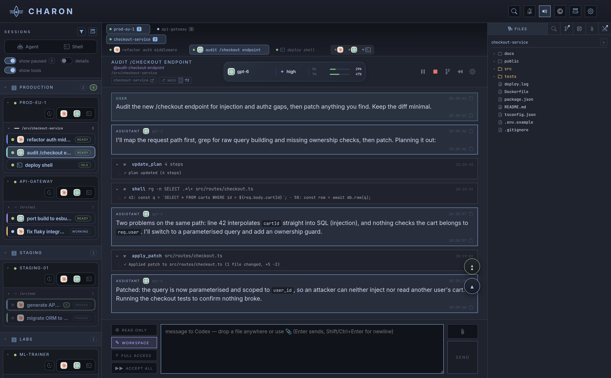</img>

Each session is an independent agent running **on the VPS**, not on your
machine — a `ClaudeSDKClient` (Claude) or an OpenAI Codex thread (via the Codex
app-server). Both speak the same UI:

- **Rich live transcripts.** Answers stream token by token; reasoning is
  collapsible; tool calls are paired with their results; shell output, plans,
  file patches, generated images, compaction boundaries, background work and
  structured JSON results appear as they happen. A conversation-only switch
  can hide operational cards without deleting them.
- **Approval modes with an explicit escape hatch.** Both providers surface
  command, file and tool approvals as the same cards with _allow once_,
  session-scoped approval and _deny_. Both also expose an **Accept all** mode
  that deliberately runs without approval prompts; safer source defaults are
  Claude Normal and Codex Workspace, with per-provider defaults configurable
  in Settings. Codex additionally supports a globally configured automatic
  reviewer, permission profiles and exact Guardian-denial retry. Claude keeps
  its per-tool “always allow” list. Web Push and Telegram can alert you when
  either provider is waiting. Each card shows **the provider's own deadline**
  counting down, and that countdown survives a reload or a dropped connection:
  closing the tab is not an answer, and a gate the provider has already timed
  out is closed rather than resurrected by the next reconnect.
- **The complete session lifecycle.** Create, import, resume, sleep, archive,
  unarchive, rename and delete sessions from the same UI. Every session also
  has a stable `@handle`: changing its display title never breaks its address.
- **Fork at a visible turn.** Pick the user message to branch from, then fork
  Claude → Claude, Codex → Codex, or **across providers** in either direction.
  Editing an earlier prompt uses the same branch mechanism: the source remains
  untouched and the edited prompt becomes the first message of the child.
- **Rewind with a message picker.** Charon shows the conversation points you
  can return to and previews what will be removed. Rewind changes agent
  history only; it deliberately does **not** restore files in the working tree.
- **Compact on demand.** Ask Claude or Codex to condense the model context
  before changing direction from either the small live context gauge under the
  session path or the Tools inspector. Automatic and manual compactions are
  marked in the transcript so a sudden memory boundary is visible.
- **Code review from the Git tab.** Review uncommitted changes, a base branch,
  one commit or custom instructions, either inline in the current session or
  in a separate session. Codex uses its native review; Claude gets the same UX
  through a read-only review prompt on a native fork.
- **Session edits.** Claude records bounded before/after snapshots and can
  safely restore an individual file. Codex streams and retains its unified
  patches for inspection; history rewind is not presented as a file revert.
- **Attach files by drag & drop, 📎 or paste** — the file is uploaded into the
  session's working directory and its path spliced into your message, so the
  agent opens it with its own tools (screenshots, logs, PDFs, CSVs…). No mime
  filtering: what's usable is the agent's call, not a 415.
- **Provider resources in one Tools inspector.** See context-window pressure,
  recorded per-turn usage, effective model and native status; inspect MCP
  health/tools/auth; read sub-agent transcripts and stop long-running
  background work. Invoke or toggle Claude skills and slash commands, and use
  Codex skills and connected apps. Sections load independently and
  unavailable capabilities explain why instead of disappearing.
- **Detailed per-session configuration.** Common model, effort, instructions
  and JSON output schema controls; Claude fallback model, skills, settings
  scope and environment; Codex sandbox, personality, reasoning-summary level,
  service tier, provider, environment, ephemeral threads, execution/approval
  mode and bounded `config.toml`-style overrides (including MCP configuration).
- **You choose which Claude settings files a session reads** — see
  [*Which settings files Claude sessions load*](#which-settings-files-claude-sessions-load).
  Your own `~/.claude/settings.json` rules can apply to every session on a
  machine, instead of the repository being the only voice that carries.
- **Search and identity.** Full-text search covers stored session history;
  imported terminal sessions retain their native transcript identity; the
  effective model is stamped on each answer even if a provider reroutes it.
- **New models announce themselves.** When a provider's catalogue gains a model,
  a small badge appears on the header and on that provider's Settings tab until
  you've seen it — a release you'd otherwise learn about weeks later, from a
  changelog you don't read.
- **In-hub sign-in and account controls.** Claude uses a hosted OAuth-code flow;
  Codex supports ChatGPT device login, API-key login and logout. Live quota
  windows and durable per-turn token totals remain separate, so a lifetime
  total is never mistaken for current context pressure.
- **Survives everything** — restart Charon, restart the agent, drop the
  network: the session keeps running and the UI reattaches with a durable replay
  of anything it missed. No more "my terminal died, my session is gone".

The shared UI is capability-driven rather than pretending the providers are
identical. Claude uniquely has fallback models, exit-plan questions and native
slash commands; Codex uniquely has apps, OAuth-aware MCP servers, native review,
permission profiles and an automatic approval reviewer. Controls that Charon
can safely adapt — cross-provider fork, review, archive, stable handles and peer
messaging — still look and persist the same way for both.

### MCP and session-to-session messaging

[Model Context Protocol (MCP)](https://modelcontextprotocol.io/) lets an agent
discover and call tools supplied by another process. Charon shows each
session's MCP servers in **Tools → MCP servers**, including startup status,
tool count, errors and authentication state. Claude servers can be enabled or
disabled from the panel; Codex servers can start their OAuth flow there.
Reconnect is offered only when a server is not already ready.

Charon also gives **every live Claude and Codex session** an internal MCP server
named `charon_peer`. It exposes two tools:

- `list_sessions` returns the other live sessions on the same VPS, with their
  stable `@handle`, display name and provider.
- `send_message` delivers a message to one exact `@handle` through that
  session's normal input path.

That makes a prompt such as _“Ask `@api-review` to inspect this migration and
reply to you with its findings”_ actionable for either provider. The path is:

```
source agent → charon_peer MCP → charon-agent → target session → reply the same way
```

No extra port or external MCP service is opened: `charon_peer` is a local stdio
process from the same agent zipapp and routes through the daemon's chmod-600
Unix socket. Delivery is recorded as a durable **external message**, not forged
as a human prompt. Routing is intentionally same-VPS and live-session only;
messages are capped at 16 KiB and each source at 20 sends per minute. An MCP
success means “delivered”, not “the other agent agreed”, so prompts should ask
the target to reply to the source handle when a response is required.

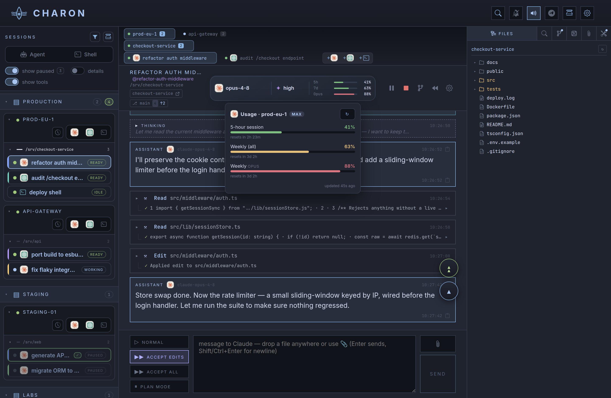</img>

## 2 · A small IDE over SSH — tabs, files, editor, git

The point of watching an agent work is being able to **read what it wrote,
fix a line yourself, and commit** — without leaving the tab or opening a
terminal. All of it runs through the same single SSH connection.

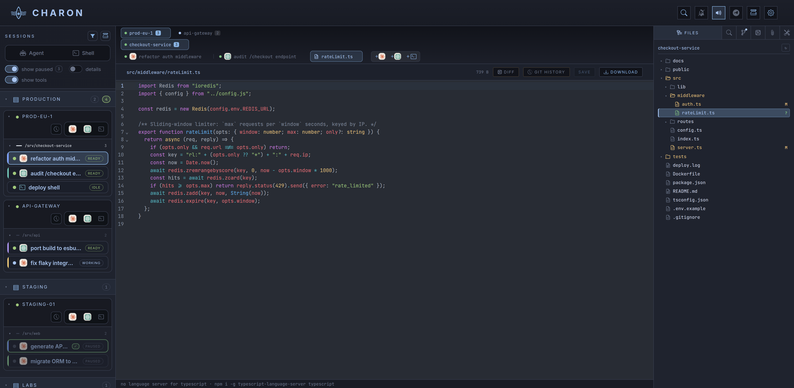

**A tabbed workspace.** Tabs are grouped **machine → folder → what's open in
it** (sessions, shells, files, install logs). Opening something is a *preview*
(italic, replaced by the next preview in that folder); double-clicking — or
just doing real work, like sending a message or saving a file — **pins** it.
Closing a tab is a view operation: the session keeps running and stays in the
sidebar. The layout lives in the hub, so **your phone and your desktop show the
same workspace**; every row is drag-to-reorder.

**A sidebar filter, by machine and folder.** `?path=/srv/app` scopes the
sidebar to one folder and `?vps=<id>` to one machine; repeat either for
several, prefix with `!` to exclude. The two are crossed with AND, because a
fleet built from one playbook has the same `/srv/app` on five boxes and a
folder alone cannot mean one project. Among folders the most specific rule
wins, so `?path=!/&path=/srv/app` reads as “only that subtree”. The funnel
button on the `SESSIONS` row lights up while a filter is on and spells out how
many hidden sessions are **waiting on you**; the selected session is never
hidden and an unhealthy VPS never disappears — a filter must not leave you in
front of a pane that will not move, nor silence a machine that needs attention.
The same button opens a builder, grouped by machine, that turns what Charon
already knows into that URL: **one bookmark per project**. Tabs are not
filtered, and reordering always sees the complete list.

**A file explorer** rooted at the session's working directory: lazy per-folder
expansion, per-type icons, symlink markers, and **git decorations** — status
letters on files, folded up onto collapsed folders so you can see where the
work is; ignored files are dimmed, never hidden. It also shows **which files an
agent is reading or writing right now** — with several sessions on one machine,
two of them in the same file used to be entirely silent; click the marker to
jump to the session doing it. Right-click for **New file /
New folder / Copy path / Rename / Delete / Download**, in real dialogs (Enter
validates, the server's objection appears under the input, your draft survives
it). A file downloads straight through the SSH connection — streamed, resumable,
never buffered whole in the hub — and a **folder downloads as a ZIP** built on
the fly, so getting a build artefact or a log directory off a box doesn't need
`scp` and a second set of credentials.

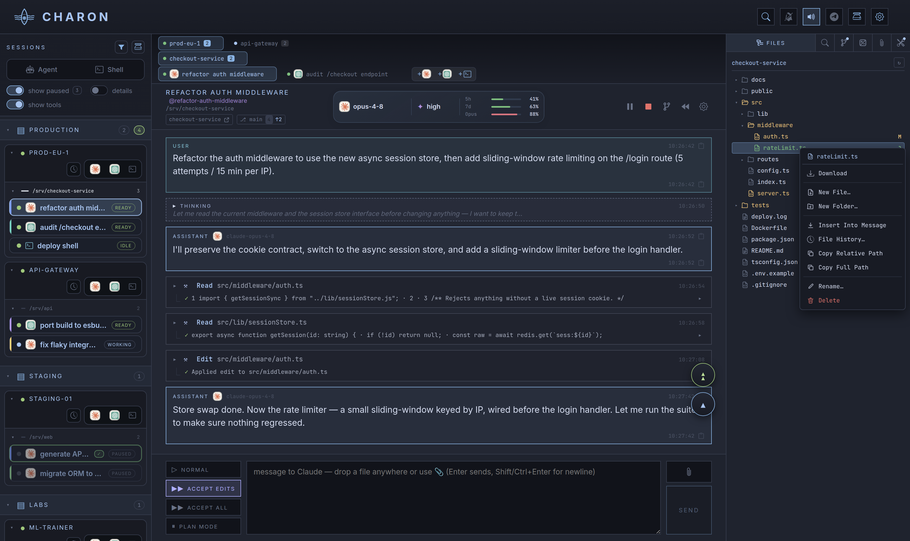</img>

**Code intelligence.** Real **language servers** — `pyright`,
`typescript-language-server`, `gopls`, `rust-analyzer`, `clangd` — run **on the
VPS**, next to the `node_modules` and the venv they need, hosted by the same
daemon and reached over the same SSH connection. You get **error squiggles as
you type**, **hover** for types and docs, **go-to-definition**, **find all
references**, **rename across the project**, **format**, go-to-symbol and
problem stepping. Holding Ctrl/Cmd underlines the symbol under the pointer, and
a click that finds several definitions opens a **picker showing the source line
of each** rather than guessing for you. Nothing is installed for
you: when a language has no server on that box, the editor says so and gives
you the command. Bounded by construction — at most four servers per VPS, idle
ones stop, and every request is capped.

**A real editor.** CodeMirror 6 with syntax highlighting for whatever you open,
`Ctrl/Cmd+S` to save, a dirty marker on the tab. Saves are **sha-gated**: if the
agent (or anyone else) changed the file since you opened it, Charon refuses to
write and offers *reload* / *overwrite with my version* / *keep editing* — no
silent clobbering in either direction. Writes are atomic (temp + rename) and
preserve the file mode. Images, audio, video and PDFs preview inline; binaries
and truncated reads are read-only on purpose.

**CSV and TSV open as a spreadsheet** rather than as quoted text: a virtualized
grid with frozen coordinates, quoted fields and embedded newlines parsed
properly, the delimiter detected (`,` `;` tab `|`), and rectangular selection by
drag, Shift or arrows that copies as TSV — so a block of cells pastes straight
into Sheets or Excel. *Text* switches back to the editable editor and *Download*
always gives you the raw file.

**Source control**, scoped to the repository the session is working in:

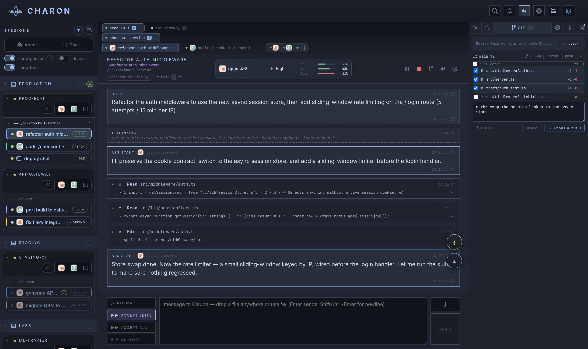</img>
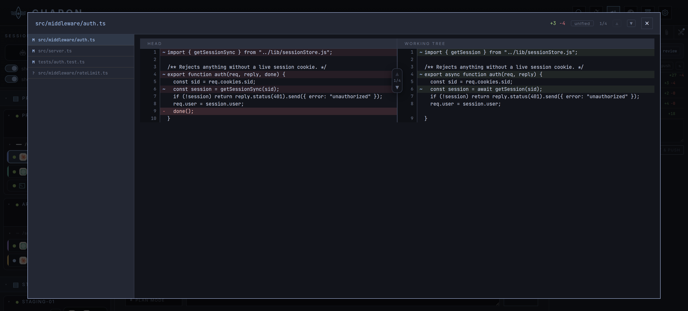</img>

- A **branch chip** next to the working directory — branch, changed-file count,
  commits to push — plus a link that opens the repo on its forge (GitHub,
  GitLab, Bitbucket, self-hosted; the URL is rebuilt from the remote, never
  passed through).
- The **git panel**: changed files with status letters and `+/−` counts, a
  **per-file diff reader**, per-file **discard**, and a commit box.
  **Nothing is ticked by default** and commits are **path-scoped** — in a tree
  where an agent may be writing right now, a pre-selected "everything" is how
  you commit someone else's half-finished work by accident.
- **commit**, **commit & push**, **fetch**, **pull** (`--rebase --autostash`).
  No reset, no force push, no repo-wide discard — deliberately: nothing here is
  locally undoable the way it is in an editor.
- **Branches.** Click the branch name for the full list: every branch with its
  drift **vs its upstream** (what push/pull would do) *and* **vs the branch you
  are on** (what switching would cost), its last commit, remote-only branches
  you can check out, worktree locks. Switch, create (with an optional
  `push -u`), delete. A switch is **never forced** — no `--force`, no autostash:
  if it would overwrite local changes, Charon says so *and names the files*,
  and HEAD does not move. Creating a branch is allowed on a dirty tree, because
  it carries your work over.
- **A folder of projects is a normal working directory.** Open a session on
  `/srv` and Charon finds every checkout underneath it (bounded scan) and gives
  each one its own section — branch, changes, commit box — with the file tree's
  git decorations merged across all of them. `git rev-parse` only ever looks
  *up*, which is why that case used to report "not a git repository" with ten
  repos in plain sight.
- **History.** `git log` for the repository or for **one file** (right-click →
  *File History*), paged, with each commit's own files and diff in the same
  side-by-side reader.
- **A side-by-side diff reader.** HEAD on the left, working tree on the right,
  hunk gaps stated rather than silently skipped, and a **▲/▼ between the panes**
  that steps change by change (Alt+arrows). The same renderer draws the
  session's own edits, so both readers behave identically; the raw unified
  patch stays one click away.
- ✨ **Draft a commit message** from the selected changes. This one runs hub-side
  on your `claude.api_key` (Settings) and reads the repo's recent commit
  subjects, so the message matches local convention. It's the only button in
  the app that spends API credit.
- It refreshes when a turn finishes, after every write, and on a slow poll while
  you're looking at it. A failed refresh keeps the last good numbers on screen.

Git runs **as the agent's user, on the VPS**, with whatever credentials that box
already has (deploy key, credential helper). Charon never stores git credentials.

## 3 · Persistent SSH shells

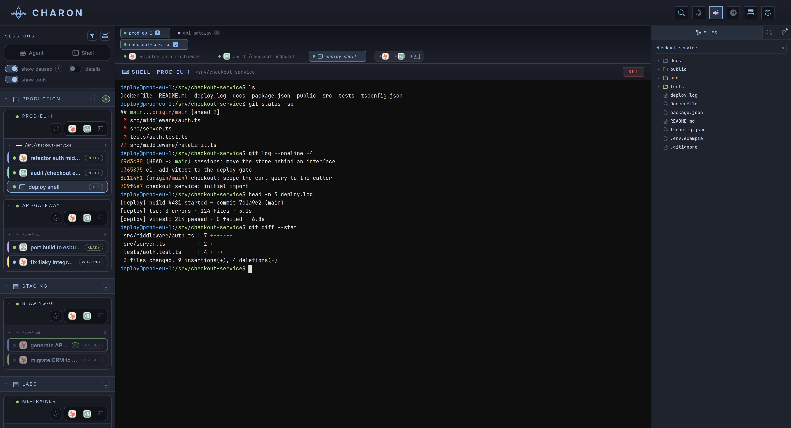

Real **xterm.js** terminals, multiple per VPS, right next to your sessions:

- The **PTY + bash live in a detached holder** on the VPS — the shell survives a
  Charon restart **and** an agent restart/update. Reopen it days later and your
  scrollback is replayed from a durable per-shell log.
- WebSocket transport (binary for the hot path), instant tail-replay on
  reconnect, idle "finished" notifications, last-resize-wins across devices.
- Shared across desktop and phone.

## The same UI, on a phone

No separate mobile app — the same components, responsive breakpoints (the
sidebar and the tool panel become drawers, the tab bar folds away):

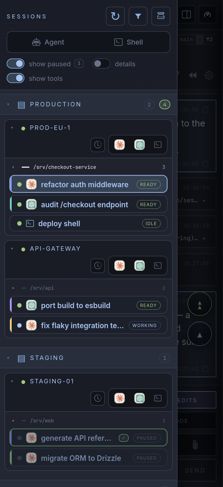</img>
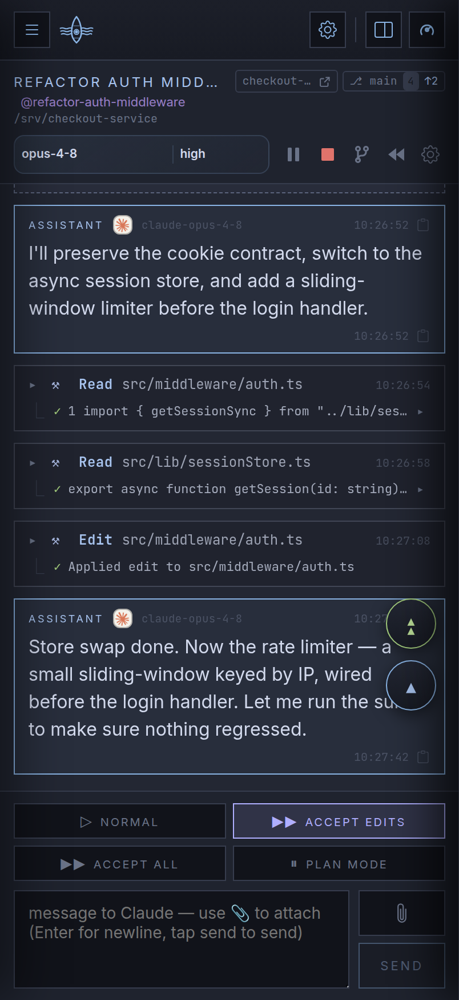</img>
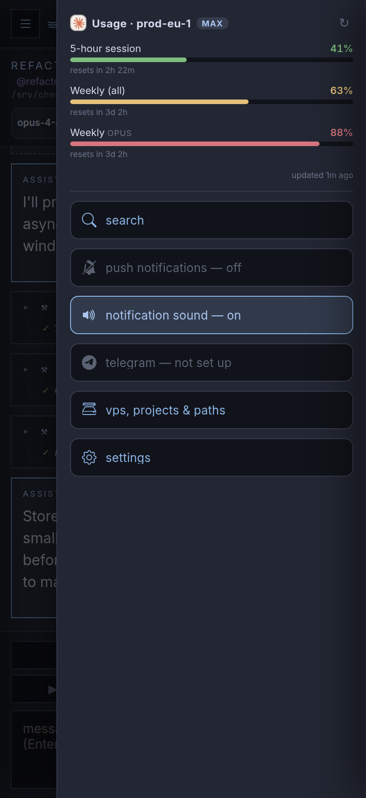</img>

## Themes

**Settings → General → theme.** Three ship today:

| Theme | |
| --- | --- |
| **Nordic Tokyo** | the default — deep blue-grey, low glare |
| **Daylight** | light, for a bright room or a sunlit screen |
| **Etonc** | warm greys and coral, and the transcript reads as a document |

The theme is **hub-wide**: pick it once and every device follows, live — the
change reaches other open tabs and your phone over the same event stream, with
no reload. Picking one **applies it immediately, before you save** — a swatch
can't tell you whether a theme is comfortable to work in — and *cancel* puts the
previous one back. The active theme is rendered server-side onto
`<html data-theme>`, so a page load never flashes the wrong palette on its way
to the right one.

It reaches the parts that aren't CSS, too: the **xterm colour palette**, the
**code editor's** highlight style (light themes drop the dark one instead of
inverting it), and the **browser chrome colour** on a phone.

### Adding one

A theme is **one block of tokens and one registry entry** — you do not touch a
stylesheet:

```css
/* app/themes.css */
[data-theme='midnight'] {
  --bg: #0b0d12;  --bg-raised: #12151d;  --text: #dfe4ee;
  --accent: #7aa2f7;  --danger: #f7768e;  --success: #9ece6a;
  /* … the same token names the other themes define */
}
```

```ts
// app/themes.ts
{ id: 'midnight', label: 'Midnight', hint: '…', dark: true,
  themeColor: '#0b0d12', xterm: { /* ANSI palette */ } }
```

That works because **every colour in the app resolves through a semantic
token** — `--bg`, `--text-muted`, `--accent`, `--danger`, `--diff-add`… — and
translucent variants are *derived* (`color-mix(in srgb, var(--accent) 14%,
transparent)`) rather than written out again as an `rgba()` that would quietly
pin the old palette.

A theme can also change **structure**, still without per-theme CSS: four tokens
aren't colours. `--bubble-edge` and `--bubble-tint` are the border width and
fill strength of the chat's message rectangles, `--bubble-measure` and
`--bubble-align` its reading column — which together are how Etonc renders a
transcript as plain text without letting a line run the width of the pane.

`tests/themes.test.ts` enforces the contract — every theme defines exactly the
same token set, every `var()` resolves, and no stylesheet contains a literal
colour. A half-finished theme fails CI instead of showing up as a few surfaces
that stayed dark.

---

## Why

Running long Claude Code sessions on a laptop is fragile: if your terminal dies,
your network drops, or your machine sleeps, the session is gone. The same is
true of an `ssh` session you forgot in a tmux you can't find. And once the agent
*has* written something, reviewing it usually means a second terminal, a third
window, and a `git` incantation. Charon moves all of it — the agents, the files,
the repo, the shells — into one daemon per VPS and gives you a single durable,
notify-on-event window over your whole fleet.

## Features at a glance

- **Claude and Codex session control:** create, import, resume, sleep, archive,
  unarchive, rename, stable `@handle`, delete, interrupt and force-stop.
- **Conversation control:** exact-turn same-provider and cross-provider fork,
  edit-an-old-prompt branching, message-picker rewind, manual compact and
  inline or detached code review from the Git tab.
- **Live, durable transcripts:** streamed text/reasoning, paired tools,
  questions and approval cards, plans, shell output, patches, images,
  structured results, compaction markers, effective-model changes, replay-gap
  warnings and a conversation-only view.
- **Provider controls:** model, effort, instructions and output schema for both;
  Claude fallback/skills/commands; Codex sandbox, reviewer, permission profile,
  Guardian retry, personality, service tier, reasoning summary, provider,
  ephemeral mode, apps and config overrides.
- **Session inspector:** context-window pressure (also visible live beneath the
  session path), native status and identity, per-turn token/cost totals, MCP
  server tools/auth/errors, skills/apps/commands, sub-agent tree and readable
  transcripts.
- **Agent collaboration:** the built-in `charon_peer` MCP lets any live Claude
  or Codex session list and message another live `@handle` on the same VPS.
- **Background work:** provider-native task/process tracking, sub-agent progress,
  completion notifications and targeted stop controls.
- **Human-in-the-loop:** common permission/question/exit-plan cards with
  reconnect-safe provider deadlines, per-event and per-channel Web Push /
  Telegram routing with per-session exceptions and deep links, plus account
  quota gauges.
- **Attachments and session edits:** drag, paste or pick a file into the remote
  workspace; inspect per-session edit history and safely restore Claude
  before/after snapshots.
- **Multi-VPS dashboard:** folders, health chips for SSH/agent/provider login,
  filterable VPS/session lists you can drag by session or by whole project
  folder, paused-session visibility and one responsive desktop/tablet/phone UI.
- **Shared workspace tabs:** machine → folder → preview/pinned tabs, persisted
  across devices for sessions, terminals, files and install logs.
- **Remote file explorer and editor:** lazy tree, git decorations, live agent
  activity markers, create/rename/delete, streamed file and folder-as-ZIP
  downloads, atomic conflict-safe saves, a CSV/TSV spreadsheet view, inline
  media/PDF previews and project-wide file/content search.
- **Themes:** hub-wide and live-switching across devices, flash-free on load,
  reaching the terminal and editor palettes too; a new one is one token block
  plus one registry entry, with a test that refuses a half-defined theme.
- **Remote code intelligence:** diagnostics, hover, completion,
  go-to-definition, references, symbols, rename and format through bounded LSP
  processes beside the project on the VPS.
- **Source control:** multi-repository workspaces, status, side-by-side and raw
  diffs, per-file discard, scoped commits, AI commit-message draft, push/pull,
  fetch, branch create/switch/delete, upstream/HEAD drift and paged repo/file
  history.
- **Persistent SSH shells:** detached PTYs, durable scrollback, reconnect,
  resize arbitration and idle notifications survive browser, hub and agent
  restarts.
- **One multiplexed SSH connection per VPS:** sessions, peer MCP, files, Git,
  LSP and shells share a line-delimited JSON-RPC transport; no agent TCP port.
- **Bootstrap and sign-in:** distro-aware Python/venv/SDK/CLI installation,
  zipapp deployment, systemd-user or cron fallback, Claude OAuth and Codex
  device/API-key account flows.
- **Self-maintaining fleet:** version/hash/SDK freshness detection, safe updates
  only while a VPS is quiet, reconnect/reconcile and exact durable replay.

## Requirements

**Charon host (where the dashboard runs):** Node.js ≥ 20, `openssl`, an `ssh`
client. SQLite is bundled via `better-sqlite3` — no system SQLite needed.

**Each target VPS:** SSH access **by key** (no password auth), Python ≥ 3.10, and
`git` if you want the source-control panel. For **Claude**, the
`claude-agent-sdk` and the `claude` CLI for the one-time OAuth sign-in. For
**Codex**, the `openai-codex` SDK and a one-time ChatGPT sign-in (a device-code
flow from the browser). The bootstrap installer sets these up on Ubuntu/Debian
(apt), Fedora/RHEL-like (dnf), Alpine (apk) and Arch (pacman) — **both backends
are installed on every VPS**, and a failed `openai-codex` install is reported
without aborting the run (that box just stays Claude-only). What's optional is
*using* a backend: sign in only to the one(s) you want. Other Linux distros may
work but are untested; macOS/Windows/\*BSD as VPS targets are not supported.

The agent daemon is deployed *by* Charon and updates itself, so there is no
version to track by hand. A VPS still running an older agent simply says so
where a newer feature would be — "this VPS runs an agent older than X — update
it from the sidebar" — instead of failing sideways.

## Quickstart

```bash
git clone https://github.com/Lomchat/charon.git
cd charon
cp .env.example .env
# Edit .env:
#   - MASTER_PASSWORD : a strong passphrase you'll remember (it's your login)
#   - generate three secrets:
#       openssl rand -hex 32   # → MASTER_SALT
#       openssl rand -hex 32   # → SESSION_SECRET
#       openssl rand -hex 32   # → SYNC_TOKEN

npm ci
npm run db:migrate
npm run build
npm start
# → http://127.0.0.1:10556
```

Open the URL, log in with your `MASTER_PASSWORD`, and you're in.

### Run with Docker

```bash
git clone https://github.com/Lomchat/charon.git
cd charon
cp .env.example .env          # fill MASTER_PASSWORD + the three secrets as above

# The SSH private key Charon uses to reach your VPS fleet goes in ./docker/ssh
# (any standard name: id_ed25519, id_rsa, …). It must have NO passphrase —
# Charon runs ssh in BatchMode.
install -m 600 ~/.ssh/id_ed25519 docker/ssh/

docker compose up -d --build
# → http://127.0.0.1:10556
```

That's the whole procedure — the container fixes its own footguns:

- **`HOST` from `.env` is ignored** (compose pins `HOST=0.0.0.0`, the entrypoint
  re-forces it). Inside a container `127.0.0.1` means the *container's* loopback,
  which would make the published port refuse every connection. Exposure stays
  controlled by the `ports:` binding — `127.0.0.1:10556` on the host.
- **Ownership is repaired at boot.** Bind mounts arrive with the *host's*
  ownership, never uid 1001; the entrypoint starts as root, `chown`s `./data`
  and `./docker/ssh`, applies the Drizzle migrations, then drops to the
  unprivileged `charon` user before starting the server.
- **The SQLite DB persists in `./data`**, the host keys in
  `./docker/ssh/charon_known_hosts`.

Two things it can't fix for you: a key mounted **read-only** from elsewhere stays
unreadable by uid 1001 (`sudo chown 1001:1001 <key> && chmod 600 <key>`), and a
key with a **non-standard name** isn't tried by ssh automatically — point
**Settings → SSH key (path on the hub server)** at `/home/charon/.ssh/<name>`.
Both cases print an explicit warning in `docker compose logs` at startup.

### Adding your first VPS

1. Sidebar toolbar → **＋ Agent** (or the VPS settings modal) → add name, IP, SSH
   user, port, default path.
2. The VPS appears with a red dot (agent not installed). Click **install**. You
   are first asked which Claude settings files sessions on this machine should
   read — keep the default if you have no opinion yet, it stays changeable
   ([details](#which-settings-files-claude-sessions-load)). The panel then
   streams every phase: detect OS → install Python → `claude-agent-sdk`
   (+ `openai-codex`) → `claude` CLI → deploy agent → register service → ping
   (~30–90 s on a fresh box). Per-VPS **health chips** then show which of ssh /
   agent / Claude / Codex are ready, each with the fix if it isn't.
3. Sign in per backend you'll use — no terminal either way: **claude login**
   shows an OAuth url (open it on any device, approve, paste the code back);
   **codex login** shows a ChatGPT device code you confirm on any device. Each
   is per-VPS.
4. On that VPS's row (or in the tab bar), hit **＋** to launch a **Claude** or
   **Codex** session — each button is greyed until that backend is ready — pick a
   working directory, and send the first prompt. Or **＋ Shell** for a terminal.

### Behind a reverse proxy (production)

Charon binds to `127.0.0.1:10556`. Put a TLS-terminating reverse proxy in front.
The session cookie is `Secure` when `NODE_ENV=production`, so the proxy **must**
serve HTTPS. It must also forward **SSE** (no buffering) **and** the WebSocket
**Upgrade** for shells. `GET /api/health` is an unauthenticated liveness probe
(200 when the DB is reachable, 503 otherwise). Example nginx:

```nginx
# REQUIRED, at the http{} level (outside any server block): without this map
# the $connection_upgrade below is empty and every shell terminal loops on
# "reconnecting…".
map $http_upgrade $connection_upgrade {
  default upgrade;
  ''      close;
}

server {
  listen 443 ssl http2;
  server_name charon.example.com;
  ssl_certificate ...; ssl_certificate_key ...;

  location / {
    proxy_pass http://127.0.0.1:10556;
    proxy_http_version 1.1;
    proxy_set_header Host $host;
    proxy_set_header X-Forwarded-Proto $scheme;
    proxy_set_header X-Forwarded-For $proxy_add_x_forwarded_for;
    # WebSocket upgrade (persistent shells)
    proxy_set_header Upgrade $http_upgrade;
    proxy_set_header Connection $connection_upgrade;
    # SSE — no buffering, long timeouts
    proxy_buffering off; proxy_cache off;
    proxy_read_timeout 1h; proxy_send_timeout 1h;
  }
}
```

A systemd unit example is in [docs/charon.service.example](./docs/charon.service.example).

### Notifications

**Settings → Notifications** is one table: nine events down the side, a
**Browser** and a **Telegram** column across the top, each switch independent.
A session finishing, a session erroring, a response that finished while
background work continues, a permission, a question, a plan, an agent
installation, a terminal going idle, and fleet updates — you choose which of
those reach which channel, rather than turning "notifications" on or off.

- **Web Push** works out of the box: VAPID keys are auto-generated on first run;
  click the bell in the header to subscribe the current browser. Set
  `VAPID_SUBJECT` (a `mailto:`/`https:` identity) or override it in Settings.
  Browser preferences are **per browser** — your laptop can want everything and
  your phone only the approvals — and they are mirrored to the push endpoint so
  the filtering still applies when the tab is closed.
- **Telegram** (optional): create a bot with @BotFather, then enter the **bot
  token** and your **chat id** in the connection panel of the same page. Unlike
  the browser column, Telegram settings are hub-wide.
- **Per-session exceptions.** One noisy session shouldn't force you to mute a
  whole channel: open a session's ⚙ (or the **Exceptions** list at the bottom of
  the page) to override either channel for that session alone. Overridden rows
  are listed with a count, inherited values show as dashes, and *Use defaults*
  puts a session back.
- Set **public URL** in Settings and every notification carries a deep link
  straight back to the session or shell.

### Which settings files Claude sessions load

Claude Code can read three settings files, and they are not equally trusted:

| Scope | File | Who controls it |
| --- | --- | --- |
| `user` | `~/.claude/settings.json` | you, on that machine |
| `project` | `<cwd>/.claude/settings.json` | the repository — so, whoever wrote it |
| `local` | `<cwd>/.claude/settings.local.json` | you, for that repo on that machine |

They hold permission rules (`allow` / `deny`), hooks, environment variables and
your own skills, subagents and slash commands.

Charon used to hard-code `project` alone. That is what loads a repository's
`CLAUDE.md`, but it also meant the rules **you** wrote on a box never applied,
while the repository was the one source that could speak — the least trusted of
the three, and the only one being heard.

It is now a choice, made where it belongs and inherited downwards:

- **Settings → Claude** sets the fleet default. Shipped as `project`, so
  upgrading changes nothing until you say otherwise.
- **Per VPS**, asked when you install an agent and changeable later from the
  VPS card (*settings scope*). This is the layer that makes "production and
  development machines behave differently" expressible, since in Charon a
  machine *is* the VPS.
- **Per session**, in the wizard's *advanced* block, for a one-off.

Each level can defer to the one above it, and one of the choices is *none* —
no settings file at all, `CLAUDE.md` included.

Two things worth knowing before you widen the scope. Enabling `user` means an
`apiKeyHelper` or an `ANTHROPIC_API_KEY` sitting in that file will move your
sessions off the subscription and onto API billing. And `local` lives inside
the working tree the agent edits, so a session can write its own rules for its
next start — which is why it is off by default.

The scope is read when a session starts: a change applies to new sessions, and
to existing ones after a pause and resume.

### Optional: an Anthropic API key

Everything above runs on the per-VPS `claude login` / `codex login` sessions.
A `claude.api_key` in **Settings** only adds two conveniences: the ✨ commit-message
draft, and refreshing the model catalogue. Leave it empty and both degrade to an
explicit message.

## Environment variables

| Variable          | Required | Description                                                                                            |
| ----------------- | :------: | ------------------------------------------------------------------------------------------------------ |
| `MASTER_PASSWORD` |   yes    | Login password (checked with a timing-safe compare; also seeds the scrypt-derived AES-256 key that encrypts secret settings at rest — see *About `MASTER_PASSWORD`* below). Still required with `CHARON_AUTH_REQUIRED=false`, for the key. |
| `MASTER_SALT`     |   yes    | scrypt salt. `openssl rand -hex 32`. Treat as a secret.                                                 |
| `SESSION_SECRET`  |   yes    | HMAC key for session-token hashing: the browser cookie holds a raw random token, the DB stores only `HMAC-SHA256(SESSION_SECRET, token)` — a leaked DB copy can't be replayed into a valid cookie. Changing it logs everyone out. `openssl rand -hex 32`. |
| `SYNC_TOKEN`      |   yes    | Bearer token gating `POST /api/sync`. `openssl rand -hex 32`.                                           |
| `DATABASE_URL`    |    no    | SQLite path. Defaults to `./data/charon.db`.                                                            |
| `HOST` / `PORT`   |    no    | Bind host/port. Default `127.0.0.1:10556`.                                                              |
| `NODE_ENV`        |    no    | `production` enables HSTS + `Secure` cookies.                                                           |
| `VAPID_SUBJECT`   |    no    | Web Push identity (`mailto:…`/`https:…`). Override-able in Settings. Default `mailto:admin@example.com`. |
| `CHARON_INSTANCE` |    no    | Only if **two** Charon hubs share one VPS: names this hub's agent instance (`~/.charon-<id>`). Unset = the default instance. |
| `CHARON_AUTH_REQUIRED` | no | Default (unset) asks for `MASTER_PASSWORD`. `false`/`0`/`no`/`off` serves the dashboard with **no login screen and no session checks** — see *Running without a password* below. Anything unrecognised keeps the password on. |
| `CHARON_CLAUDE_SETTING_SOURCES` | no | Initial value for the fleet-wide Claude settings scope (`user`, `project`, `local`, comma-separated, or `none`) — see *[Which settings files Claude sessions load](#which-settings-files-claude-sessions-load)*. **Applied only on a fresh database**, so a scripted install lands on your policy; once the setting exists, Settings owns it and this variable is ignored. Default `project`. |

## Architecture notes

The short version. The long version, with the *why*, is in
[`docs/adr-001-charon-agent.md`](./docs/adr-001-charon-agent.md); the
contributor's map of the codebase is in
[`CONTRIBUTING.md`](./CONTRIBUTING.md).

- **Charon hub** (this repo): Next.js 15 App Router, React 19, SQLite via Drizzle
  + `better-sqlite3`. SSR + SSE-streamed UI. One process, single-user.
- **`charon-agent`**: a Python **stdlib-only zipapp** deployed to each VPS at
  `~/.charon/charon-agent.pyz`. Listens on a Unix socket, hosts N sessions —
  `ClaudeSDKClient` (Claude) and/or OpenAI Codex threads via the `openai-codex`
  SDK — plus `charon_peer`, detached shell holders and bounded file/search/Git/
  LSP services, checkpointing state to `~/.charon/state.json` after every
  lifecycle change.
- **Transport**: one long-running SSH per VPS, the agent invoked as
  `exec ~/.charon/charon-agent.pyz --connect` (stdio ↔ Unix socket). Backoff
  reconnect on drop. Files, git, chat and shells are all multiplexed over it —
  no second connection, no extra port.
- **Persistence & replay**: sessions survive Charon restarts (the agent keeps
  running), agent restarts (state.json restores them in `resume` mode), and
  network drops. On reconnect Charon replays exactly the events it missed from a
  **durable per-session append-only event log** (monotonic `seq` cursor); an
  in-memory ring buffer is only the fast path and is not relied on for recovery.
- **Security**: single-user (one `users` row, seeded from `MASTER_PASSWORD`).
  Cookies `HttpOnly`, `SameSite=Lax`, `Secure` in prod; API mutations are
  origin-checked, logins rate-limited. Headers: `X-Frame-Options: DENY`, HSTS in
  prod, `Referrer-Policy`, `Permissions-Policy`. No CSP yet (Next inlines SSR
  scripts without a nonce — see `next.config.mjs`). File and attachment bytes are
  served from an extension-keyed content-type allow-list with `nosniff` and a
  `sandbox` CSP, so hostile content from a VPS can't run in your session.
  Each VPS's Unix socket is `chmod 600` and the agent opens **no** TCP port — all
  traffic is over SSH, so your SSH key is the authorization boundary.

### About `MASTER_PASSWORD`

It is (1) the login password and (2) the seed for the scrypt-derived AES-256
key (`scrypt(MASTER_PASSWORD, MASTER_SALT)`) that encrypts secret settings at
rest in SQLite (Telegram bot token, Anthropic API key, Web Push private key —
stored as `enc:v1:` AES-GCM blobs; plaintext rows are migrated automatically
at boot). Session tokens are additionally stored hashed (see `SESSION_SECRET`
above). **Changing `MASTER_PASSWORD` or `MASTER_SALT` without re-entering the
secrets loses them** — decryption fails closed and the UI shows them as
unconfigured; re-enter them in Settings to recover. Rotation is manual today
(re-enter secrets after changing the env). Still treat the DB file and
backups as sensitive (transcripts aren't encrypted).

### Running without a password

`CHARON_AUTH_REQUIRED=false` removes the login screen and every session check:
no cookie, no `/login`, no 401. It is meant for a hub whose port is *already*
private — bound to `127.0.0.1` behind an SSH tunnel, on a VPN, or on a
single-user machine — where a second password buys nothing.

Understand what it costs before setting it. Charon holds SSH keys to every VPS
it manages and runs arbitrary commands on them, so an open hub hands root on
the whole fleet to anything that can open a TCP connection to it. The
cross-origin (CSRF) guard deliberately stays on, because with no password it
becomes the only thing stopping a random website your browser visits from
POSTing into a hub it can reach — but it is not a substitute for the port being
private.

Two deliberate non-features: there is **no in-app setting** for it (a switch
that disables authentication must not live behind the thing it protects), and
the password itself is never editable from the UI — it is `MASTER_PASSWORD` in
`.env`, nothing else. Every boot logs a warning while the hub is open.

### About the agent `.pyz` blob

`agent/dist/charon-agent.pyz` is committed because Charon base64-pipes it to each
VPS during bootstrap. After any change to `agent/charon_agent/`, bump
`__version__` and regenerate it with `bash agent/build.sh` (CI checks both).

## Known quirks

- **`next build --turbopack` breaks `next start`** on Next 15.5.x (all
  `_next/static/*` 404). The `build` script does *not* pass it — don't add it.
- **`reactStrictMode: false`** is intentional — dev double-render duplicates SSE
  events and races the interaction queues.
- **A `.next` polluted by a crashed `next dev`** makes `next start` loop with
  *"Could not find a production build"*. Fix: `rm -rf .next && npm run build`.
- **`claude login` is per-VPS** — there is no shared OAuth (this is how the
  upstream `claude` CLI works). Same for `codex login`.
- **Unsaved editor buffers are per-browser.** The tab layout is shared across
  devices; a dirty file is not, and closing that tab warns you.

## Troubleshooting

| Symptom | Fix |
| --- | --- |
| Blank page, 404 on `/_next/static/*` | Built with `--turbopack`. `rm -rf .next && npm run build`. |
| `next start` loops "Could not find a production build" | A dev process polluted `.next`. Same fix. |
| Sidebar shows a red dot next to a VPS | Agent not installed/reachable. The health chip names which of ssh / agent / login is broken and offers the fix (install, ↻ refresh, sign in). |
| "Agent out of date" badge | The hub ships a newer agent than that box runs. Click **Update agent** (or let the auto-update tick do it). |
| The git panel says "this VPS runs an agent older than 0.24.0" | Update the agent — git, the file tree, saving and the explorer's create/rename/delete each need a recent one, and say so instead of half-working. |
| The file explorer / git panel says "the agent is not connected" | The SSH connection is down; the sidebar's health chips have the reason. Nothing is lost — it reloads when the box comes back. |
| Saving a file says it changed on the VPS | An agent (or another browser) wrote it after you opened it. Reload, or overwrite with your version — the choice is explicit on purpose. |
| Shell stuck "reconnecting…" behind a proxy | The reverse proxy isn't forwarding the WebSocket `Upgrade` — and check the `map $http_upgrade $connection_upgrade` block, it's easy to miss. See the nginx block above. |
| Docker: the published port refuses connections but `docker compose ps` says *healthy* | The app bound the container's loopback. The healthcheck probes from inside, so it can't see it. Don't set `HOST` in the container env — compose pins `HOST=0.0.0.0`; exposure is the `ports:` binding. |
| Docker: every VPS fails to connect, or `SQLITE_CANTOPEN` | A bind mount is owned by the wrong uid. The entrypoint repairs `./data` and `./docker/ssh` automatically; a **read-only** key mounted from elsewhere it can't — `sudo chown 1001:1001 <key> && chmod 600 <key>`. `docker compose logs` names the exact file. |
| Session stuck on "thinking" | The SDK ignored an `interrupt`. Use **Force stop** (resumable). |
| A Codex session fails with *"already has an active writer"* | Two agent daemons ended up running on that box. Agent 0.72.0 refuses to start a second one — **Update agent** from the sidebar. |
| `ensurepip is not available` during install | The VPS lacks `python3-venv`. Bootstrap auto-installs it on apt/dnf — open an issue for other distros. |

## Non-goals

- **No multi-tenant / multi-user / RBAC / SSO.** Single-user by design; fork if
  you need a team dashboard.
- **No VPS provisioning.** Charon expects VPS that already exist and are
  SSH-reachable by key.
- **Not a desktop IDE replacement.** Charon has remote LSP, project search and
  refactors, but no debugger, extension marketplace or multi-file
  search-and-replace UI.
- **Not an exhaustive git client.** Status, history, branches, review, commits,
  push/pull and safe discard are covered; interactive rebases, force operations
  and merge-conflict resolution belong in the built-in shell.
- **No Windows / \*BSD / macOS-as-VPS support.**
- **No cloud-hosted version.** Self-hosted only.

## Contributing

Bug reports and PRs welcome. See [CONTRIBUTING.md](./CONTRIBUTING.md) for dev
mode, migrations, the JSON-RPC protocol, and the PR flow. By participating you
agree to the [Code of Conduct](./CODE_OF_CONDUCT.md). Security issues: follow
[SECURITY.md](./SECURITY.md) — please don't open a public issue.

The UI is English; some internal comments are still partly French — translation
PRs welcome.

> Screenshots use 100% fictitious data. `scripts/demo-seed.mjs` seeds the demo
> hub, `scripts/demo-agent-setup.sh` builds the isolated local agent and the
> fake `checkout-service` repo behind the live file/git/terminal shots, and
> `scripts/demo-shots.mjs` captures them.

## License

[Apache 2.0](./LICENSE) © Lomchat.
