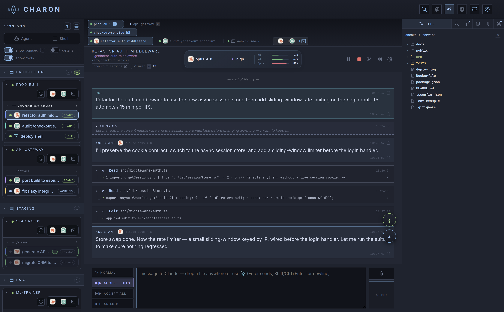
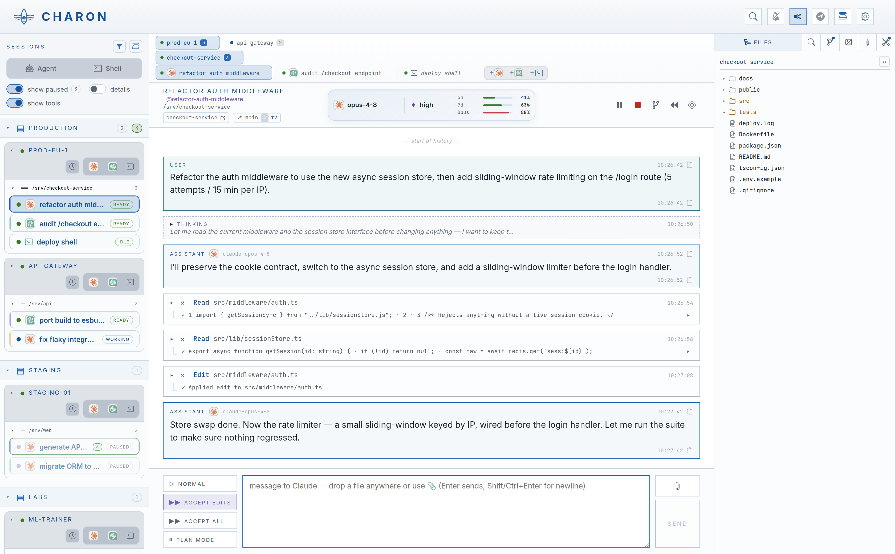
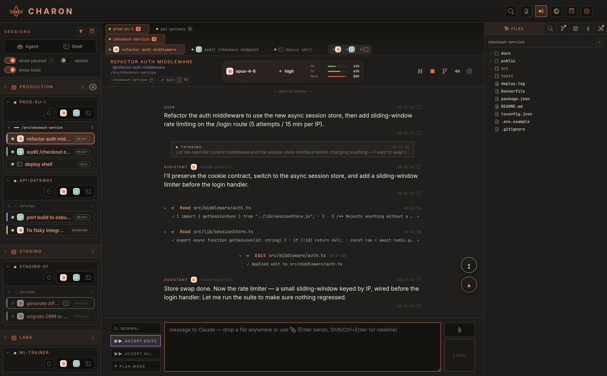
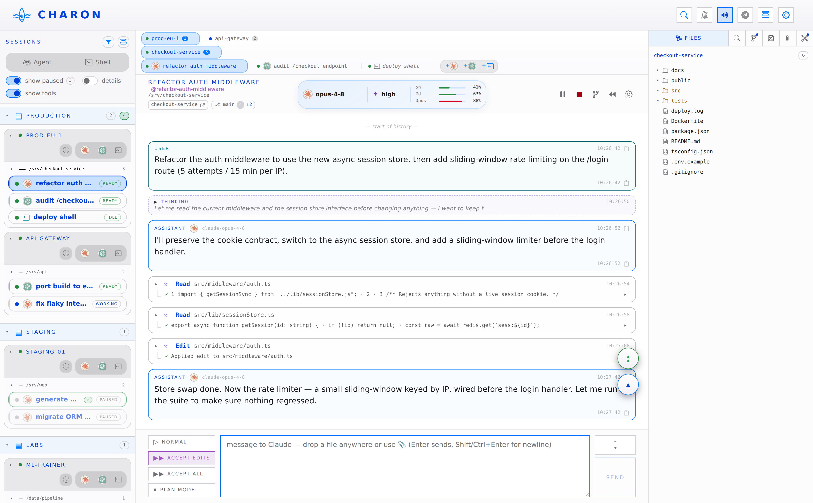
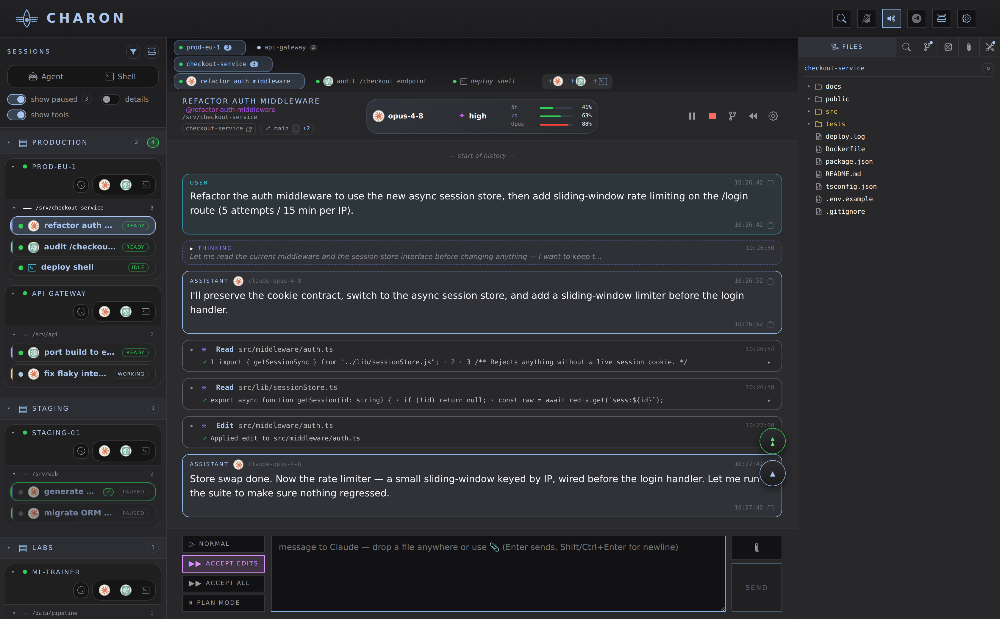

# Interface and themes

These screenshots show the current Charon interface with fictitious sessions,
accounts and servers. The file explorer, editor, Git panel and terminal use a
real isolated agent and a disposable `checkout-service` project.

Choose a theme in **Settings → General → theme**. The selection applies across
the hub, including other open tabs and mobile devices.

## Theme gallery

The same Claude conversation and desktop viewport in each of the five themes.
Click an image to inspect it at full resolution.

### Nordic Tokyo

The default: deep blue-grey with cool accents.



### Daylight

A light palette for bright rooms.



### Etonc

Warm greys, coral accents and a transcript laid out like a document.



### Cupertino

Light grey window chrome, white content and fine borders.



### Cupertino Night

The same Mac-inspired layout in a dark palette.



## Recreate the screenshots

Run from the repository root on a Linux demo host with Node 20+, Python 3.10+,
SSH and Chromium through Playwright. Install the repository dependencies first.
The setup script resets `/srv/checkout-service` and the dedicated `charondemo`
user's agent state; reserve both for this demonstration.

1. Use a current production build. On a separate checkout, run
   `node node_modules/next/dist/bin/next build`. The repository's `npm run build`
   also migrates and triggers deployment; the demo only needs the build output.
2. Install the optional capture dependency without changing the lockfile:
   `npm install --no-save --package-lock=false playwright`, then
   `npx playwright install chromium`.
3. Create and populate the dedicated database, then prepare the isolated agent:

   ```sh
   DATABASE_URL=./data/demo.db node scripts/migrate.mjs
   node scripts/demo-seed.mjs
   sudo bash scripts/demo-agent-setup.sh
   ```

4. Start the second hub on loopback in another terminal. It reads the local
   `.env` for authentication; keep the same `SESSION_SECRET` when seeding.

   ```sh
   NODE_ENV=production HOST=127.0.0.1 PORT=10999 \
     DATABASE_URL=./data/demo.db CHARON_DISABLE_AUTOCONNECT=1 \
     node --require dotenv/config server.js
   ```

5. Run `node scripts/demo-shots.mjs`. Captures go to `docs/img/`.
   Use `SHOTS=dashboard,theme-daylight` to capture a subset. `DEMO_DB` and
   `DEMO_BASE` override the demo database and local URL; `DEMO_CHROMIUM` can
   point to an existing Chromium executable. A failed capture exits nonzero.
6. Inspect the images before committing. Stop the demo hub and isolated agent
   when finished.

Chat, runtime events and account usage use fictitious fixtures; no real
provider account or model turn is needed. Theme selection uses the normal settings API. The script
captures rendered UI without recolouring or rebuilding it for the images.
